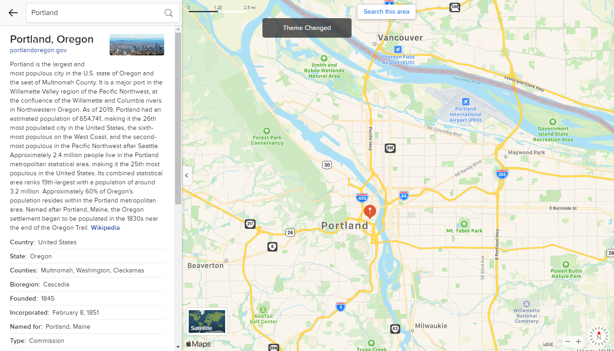
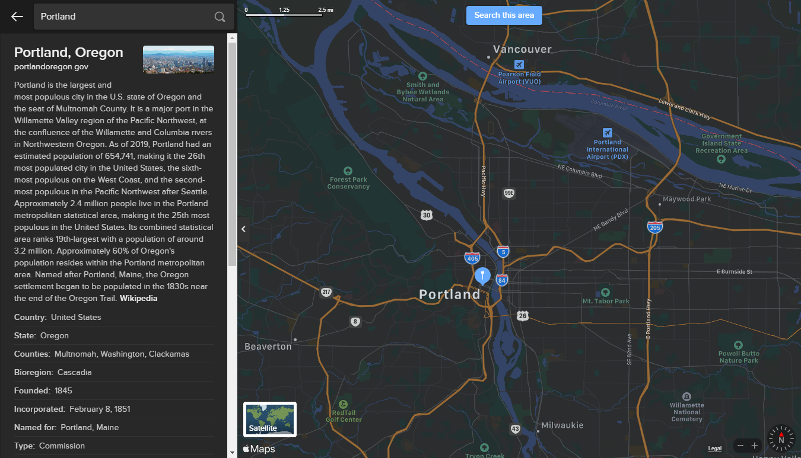
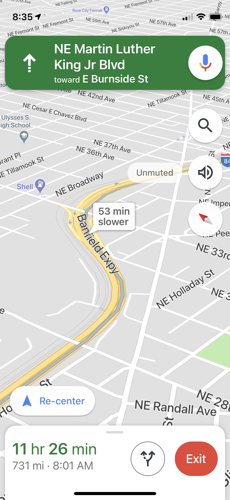
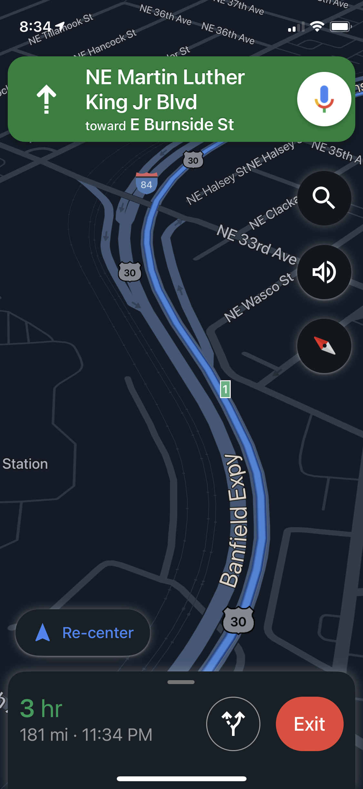
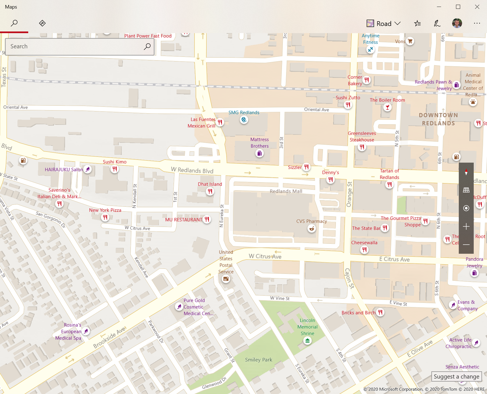
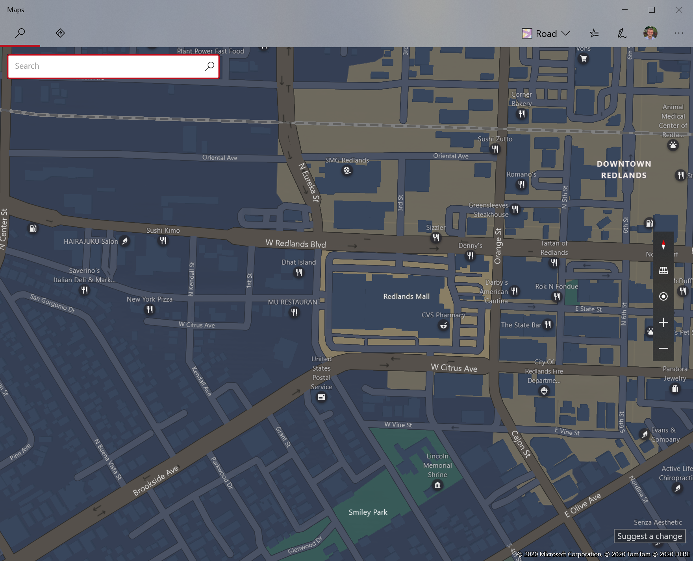
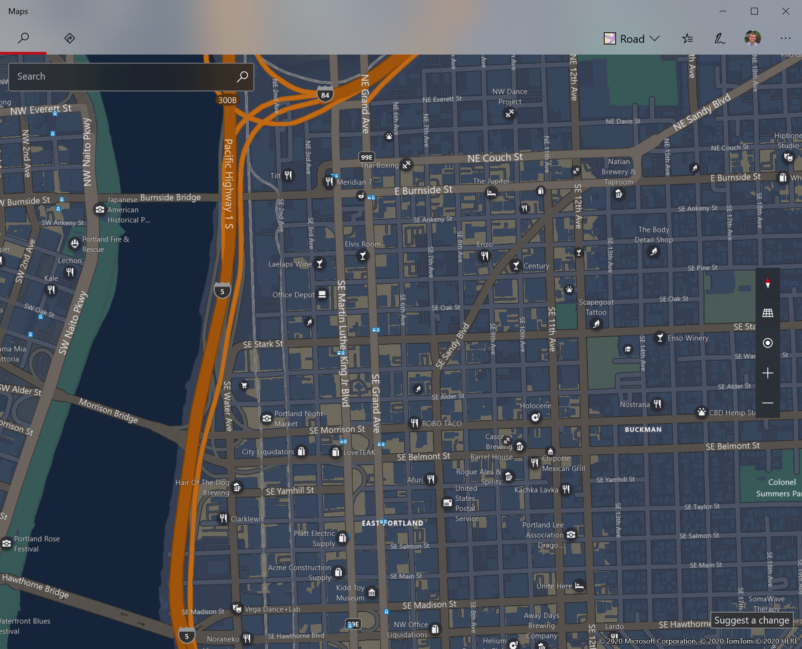
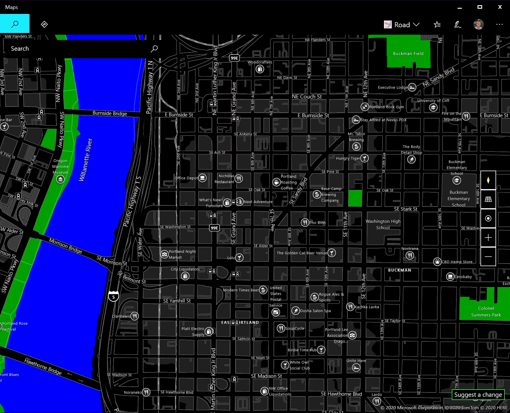
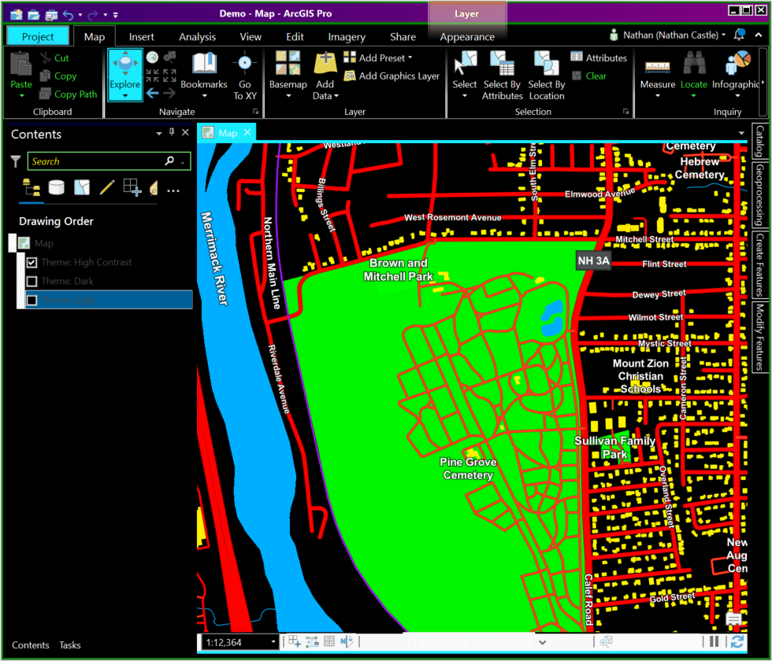

# theme-adaptive-maps-prototype

A pattern for supporting light, dark, high contrast, and other color schemes in ArcGIS maps.

* Demo code: [demo](./demo/)
* Detailed spec: [Spec.md](./Spec.md)
* Walkthrough (keep reading)

## Background and motivation

Until recently, most apps only supported a dark-on-light color scheme. This retina-scorching reality was shattered in 2019 with the parallel developments of system-wide Dark Mode support in iOS 13, `prefers-color-scheme` in CSS, and system-wide support in Android 10. Windows 10 natively supports dark mode as do many Linux desktop environments.

**The time is now to support dark mode**

Beyond support for dark mode, Esri has identified accessibility as a priority for our products. High contrast is an accessibility feature that makes it easier for users to see boundaries between elements and read text. Many operating systems, including [Windows](https://support.microsoft.com/en-us/windows/use-high-contrast-mode-in-windows-10-fedc744c-90ac-69df-aed5-c8a90125e696) and macOS support a high contrast mode. 

**The time is NOW to support High Contrast mode**

> [Real users care about this](https://www.reddit.com/r/Blind/comments/5n99av/google_maps_and_high_contrast/)

### Existing map applications

Support for light, dark, and high contrast modes is not without precedent among mapping applications.

Apple Maps:

| Light | Dark |
|---------|---------------|
|  |  |

Google Maps (navigation only):

| Light | Dark |
|---------|---------------|
|  |  |

Bing Maps:

| Light | Dark |
|---------|---------------|
|  |  |

Support for High Contrast mode is more limited, but Bing Maps offers at least one example on Windows:

| Default | High Contrast |
|---------|---------------|
|  |  |

### Patterns in ArcGIS

In the absence of core platform support for a feature, common patterns are used to enable common mapping features.

One of the most common patterns is support for a floor switcher using a feature layer definition expression. More recently, ArcGIS Indoors has formalized floor support in the [ArcGIS Indoors Information Model](https://pro.arcgis.com/en/pro-app/help/data/indoors/arcgis-indoors-information-model.htm). Any app working with ArcGIS Indoors can rely on facilities having a `LEVEL_ID` to enable a floor picker; [Field Maps](https://www.esri.com/arcgis-blog/products/field-maps/field-mobility/whats-new-in-arcgis-field-maps-october-2020-beta-update/) demonstrates this.

## A pattern for supporting color modes

This post proposes a new pattern for supporting themes in ArcGIS. Details of the proposal are defined in [Spec.md](./Spec.md), summarized below:

* Web & mobile maps & scenes are authored with top-level `GroupLayer` entries
    * Each group layer corresponds to a specific theme, and is named as such
    * Contents of each layer should be identical, with the exception of styling/theming
    * Any mapping application can show the full contents of the map without causing problems
    * *Theme-aware* applications will hide the top-level group layers for all but the currently-selected theme
    * *Theme-aware* applications can select a theme automatically
        * Best practice (in general, not specific to ArcGIS) is to always allow user choice
    * The desired 'default' group should be visible by default; all others should be hidden by default
* The pattern defines `Light`, `Dark`, and `High Contrast` themes
    * Additional themes can be defined (e.g. `Red`, `Solarized`, etc.)
    * Maps can define any number of variations; a map supporting `Dark` theme is not required to support `High Contrast`

Like any pattern-based mapping feature, there are benefits and drawbacks.

Benefits:

* Maps authored in this pattern will be compatible with ArcGIS apps, regardless of whether they are theme-aware
* This technique can be used _today_, no platform changes needed
* This pattern is flexible; you can adopt as much or as little of it as you want

Drawbacks:

* In non-theme-aware applications, things like legends and tables of contents will be polluted with extra layers for different themes
* Non-theme-aware applications may see reduced performance from loading extra layers
* Applications that support editing will need to consider that feature layers will be in the map multiple times; options include manually refreshing data after features are changed and preventing theme changes while editing is in progress.
* There is no support for system-provided accent colors, or specific override colors in the context of High Contrast mode.

## Adapting content for themes

Esri already provides basemaps in light and dark variations. With the [Vector Tile Style Editor](https://developers.arcgis.com/vector-tile-style-editor/), it is trivial to create variations for High Contrast or any other color scheme.

The following screenshot shows a high contrast map in use with ArcGIS Pro in high contrast:

## A path to platform support

While the pattern here is a great start, it has a few serious limitations:

* Because the themes are fixed, there is no support for tinting or custom accessibility colors
* Having duplicate content clutters the web map, and can cause confusion in editing scenarios
* Because this pattern isn't explicitly implemented by any ArcGIS apps, map authors have to go out of their way to use it
* It can be cumbersome to come up with color sets that work for each color theme

Map theming could be improved with the following additions to the map and scene specifications:

* Baked-in setting alternatives, rather than using multiple group layers. For example, a feature layer could define a renderer. Separately, alternative renderers for light and dark mode could be supplied
* The background color of the map could be specified for multiple themes
* Color variables could be defined at the map level; multiple renderers could reference those variables.
* Metadata should be added to the document specifying which themes are supported and how themes should be selected (e.g. user choice, always default to dark, etc.)
